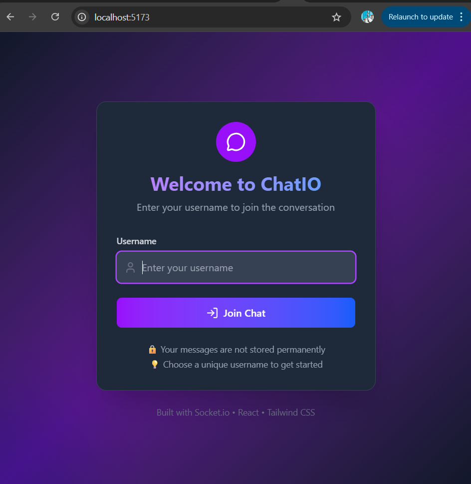
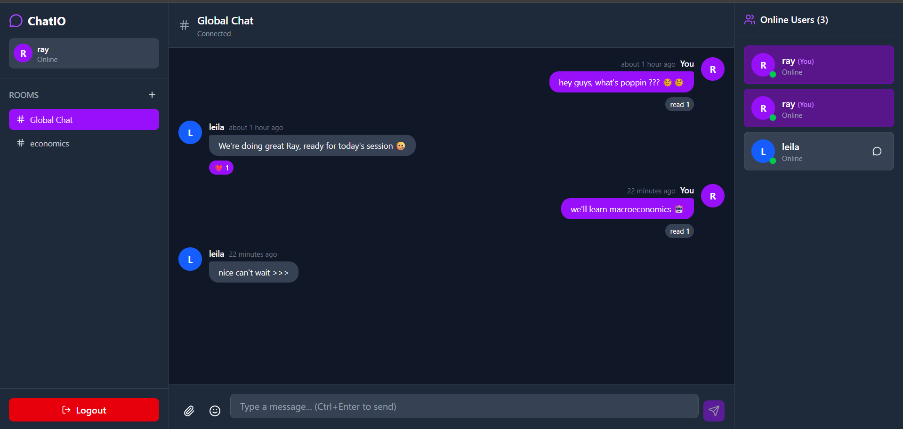
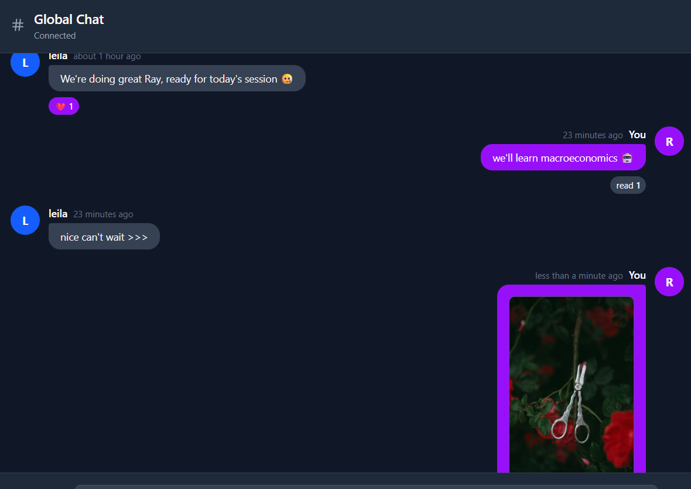
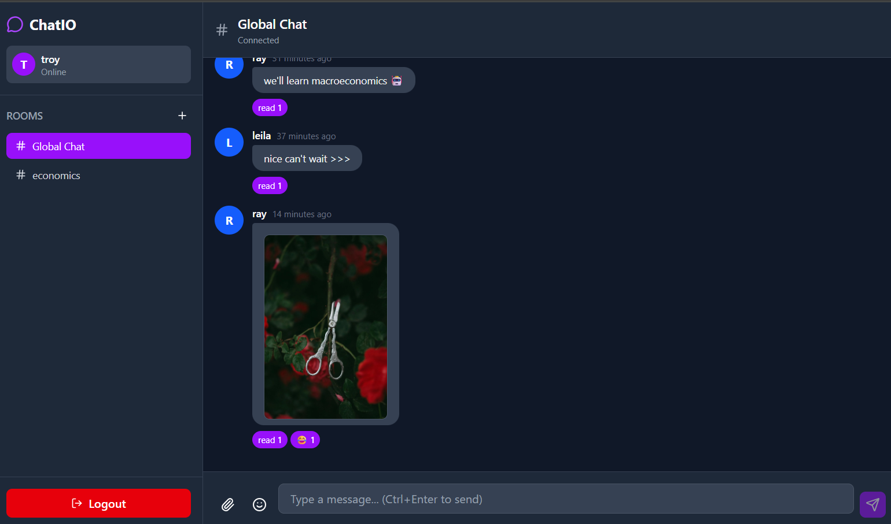
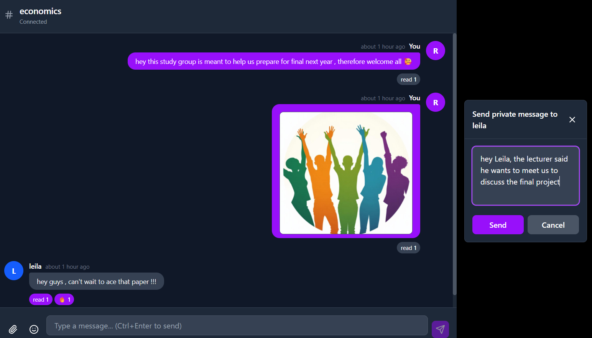
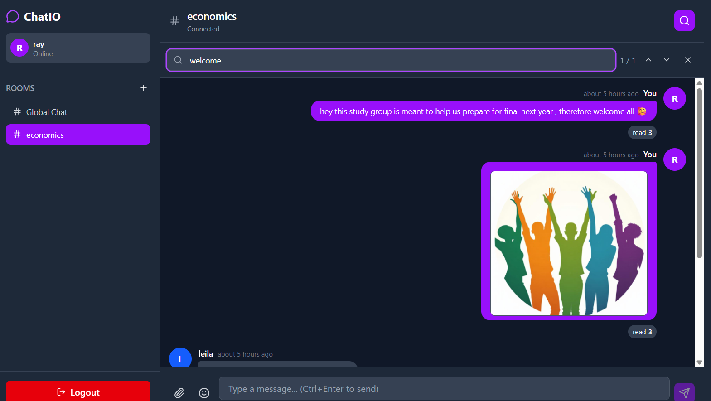
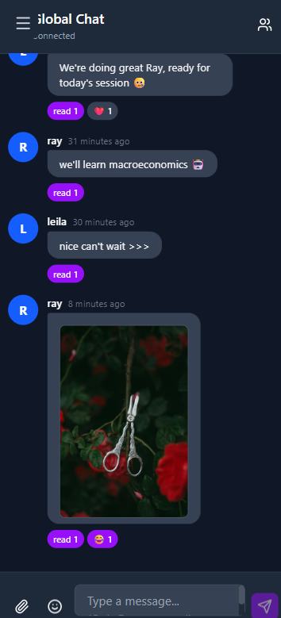
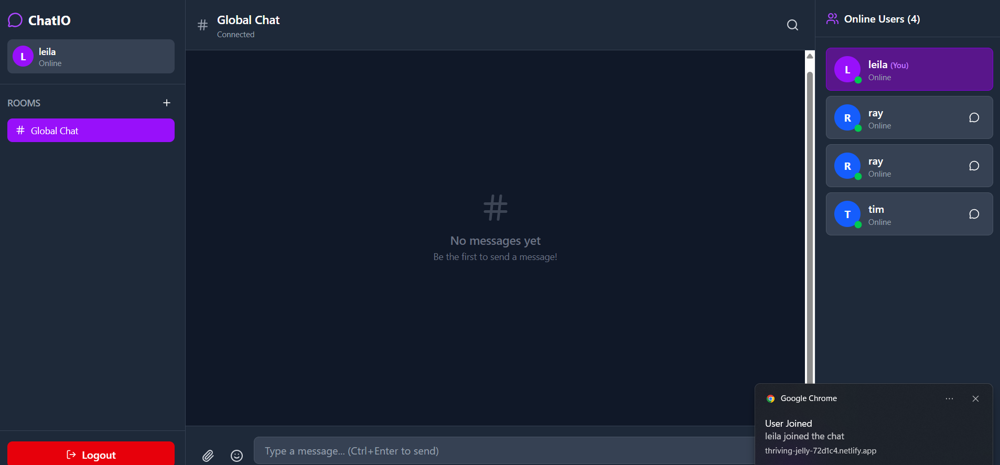
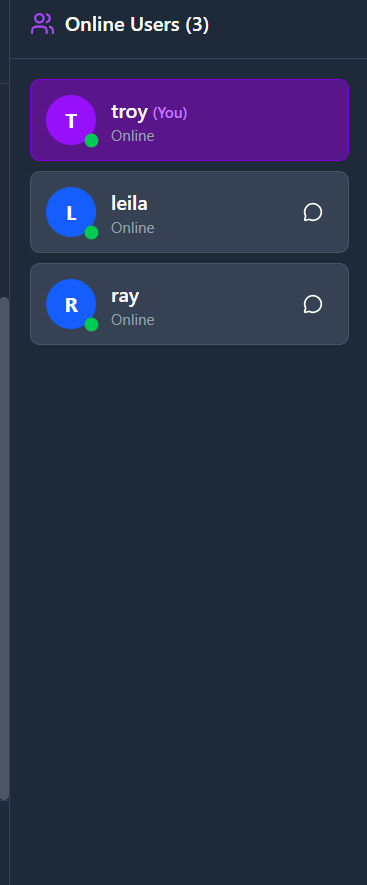

# 💬 ChatIO - Real-Time Chat Application

<div align="center">


**A fully-featured real-time chat application built with Socket.io, React, Express, and Tailwind CSS v4**

[](https://choosealicense.com/licenses/mit/)
[](https://nodejs.org/)
[](https://react.dev/)
[](https://socket.io/)

[Live Demo](#-live-demo) • [Features](#-features) • [Screenshots](#-screenshots) • [Getting Started](#-getting-started) • [Documentation](#-documentation)

</div>

---

## 🌐 Live Demo

> **Live Application:** [Your Deployed App URL Here]
>
> **Server API:** [Your Server URL Here]
>
> **Status:** 🟢 Online

### Quick Test Accounts
Try the app with these test usernames:
- `Alice` - Test user 1
- `Bob` - Test user 2
- `Charlie` - Test user 3

---

## 📸 Screenshots

### Login Screen

*Beautiful authentication screen with gradient background and glassmorphism effects*

---

### Main Chat Interface

*Real-time messaging with typing indicators and user presence*

---

### Message Features

*Message reactions, read receipts, and file sharing*

---

### Multiple Chat Rooms

*Create and join multiple chat rooms with ease*

---

### Private Messaging

*Send direct messages to specific users*

---

### Message Search

*Powerful search functionality with keyboard shortcuts*

---

### Mobile Responsive
<div align="center">
  
</div>

*Fully responsive design optimized for mobile devices*

---

### Notifications

*Desktop notifications and sound alerts for new messages*

---

### User List

*Online users with status indicators*

---

## ✨ Features

### 🔐 Core Chat Functionality
- **User Authentication** - Simple username-based authentication with session persistence
- **Real-Time Messaging** - Instant message delivery using Socket.io WebSockets
- **Global Chat Room** - Default chat room where all users can communicate
- **Message History** - Load previous messages when joining a room (last 50 messages)
- **Typing Indicators** - See when other users are composing messages
- **User Presence** - Real-time online/offline status for all users
- **Timestamps** - Relative time display (e.g., "2 minutes ago")

### 🚀 Advanced Features
- **Private Messaging** - Send direct messages to specific users with visual indicators
- **Multiple Chat Rooms** - Create and join different chat rooms with custom names
- **Public & Private Rooms** - Choose room visibility when creating
- **File Sharing** - Upload and share images, PDFs, and documents (up to 5MB)
- **Image Preview** - Automatic image preview in chat for uploaded images
- **Message Reactions** - React to messages with emojis (👍 ❤️ 😂 🎉 🔥)
- **Reaction Toggle** - Add or remove your reactions by clicking
- **Read Receipts** - See who has read your messages with ✓ and ✓✓ indicators
- **Emoji Picker** - Integrated emoji picker for expressive messaging

### 🔔 Real-Time Notifications
- **Browser Notifications** - Desktop notifications using Web Notifications API
- **Sound Alerts** - Audio notification for incoming messages (Web Audio API)
- **Unread Count Badge** - Visual badge showing unread message count
- **Join/Leave Notifications** - System messages when users join or leave chat
- **Smart Notifications** - Only notify when tab is in background
- **Permission Management** - Request and manage notification permissions

### 🔍 Message Search
- **Full-Text Search** - Search through all messages in current room
- **Search by Content** - Find messages by text content
- **Search by Sender** - Find all messages from a specific user
- **Search by File Name** - Find messages with specific file attachments
- **Result Navigation** - Navigate through multiple search results with arrows
- **Keyboard Shortcuts** - Ctrl+F to open search, Enter/Shift+Enter to navigate
- **Visual Highlighting** - Found messages highlighted with yellow ring
- **Result Counter** - Shows current result position (e.g., "2 / 5")
- **Real-Time Updates** - Search results update as new messages arrive

### ⚡ Performance & UX Optimization
- **Message Pagination** - Loads last 50 messages initially, stores max 100 per room
- **Auto-Reconnection** - Automatic reconnection with visual status indicator
- **Connection Status** - Real-time connection state display
- **Optimized Broadcasting** - Efficient room-based message broadcasting
- **Throttled Typing** - Typing indicators throttled to max 1 update per 2 seconds
- **Memory Management** - Automatic message limit to prevent memory issues
- **Loading States** - Visual feedback for all async operations
- **Error Handling** - Comprehensive error handling with user-friendly messages
- **Smooth Animations** - CSS transitions for all UI interactions

### 📱 Responsive Design
- **Desktop Layout** (1024px+) - Three-column layout with all features visible
- **Tablet Layout** (768-1023px) - Collapsible sidebars for optimal space usage
- **Mobile Layout** (<768px) - Full-screen chat with hamburger menus
- **Touch Optimized** - Touch-friendly interactions for mobile devices
- **Adaptive UI** - UI elements adapt to screen size automatically

### 🎨 Modern UI/UX
- **Dark Theme** - Beautiful dark mode interface with purple/blue accents
- **Glassmorphism** - Modern glassmorphism effects on login screen
- **Gradient Backgrounds** - Attractive gradient backgrounds and buttons
- **Custom Scrollbars** - Styled scrollbars matching the dark theme
- **Icon Library** - Lucide React icons for consistent visual language
- **Hover Effects** - Interactive hover effects on all clickable elements
- **Visual Feedback** - Animations and transitions for all user actions

### 🔒 Security & Best Practices
- **Input Validation** - Username and message validation
- **File Size Limits** - 5MB maximum file upload size
- **CORS Configuration** - Proper CORS setup for secure communication
- **Environment Variables** - Sensitive data stored in environment variables
- **XSS Prevention** - React's automatic escaping prevents XSS attacks
- **Error Boundaries** - Graceful error handling throughout the app

---

## 🛠️ Technology Stack

### Frontend
| Technology | Version | Purpose |
|------------|---------|---------|
| **React** | 18.2.0 | UI library for building components |
| **Vite** | 5.0.11 | Fast build tool and dev server |
| **Tailwind CSS** | 4.0.0 | Utility-first CSS framework |
| **Socket.io Client** | 4.6.1 | Real-time WebSocket communication |
| **date-fns** | 3.0.0 | Date formatting and manipulation |
| **Lucide React** | 0.263.1 | Beautiful icon library |
| **emoji-picker-react** | 4.5.16 | Emoji picker component |

### Backend
| Technology | Version | Purpose |
|------------|---------|---------|
| **Node.js** | 18+ | JavaScript runtime environment |
| **Express** | 4.18.2 | Web application framework |
| **Socket.io** | 4.6.1 | Real-time bidirectional communication |
| **Multer** | 1.4.5 | File upload handling middleware |
| **UUID** | 9.0.0 | Unique ID generation |
| **CORS** | 2.8.5 | Cross-origin resource sharing |
| **dotenv** | 16.0.3 | Environment variable management |

---

## 📂 Project Structure

```
socketio-chat/
├── client/                          # React frontend application
│   ├── public/                      # Static assets
│   │   └── vite.svg                 # Vite logo
│   ├── src/
│   │   ├── components/              # React components
│   │   │   ├── LoginScreen.jsx     # Authentication screen
│   │   │   ├── ChatLayout.jsx      # Main layout wrapper
│   │   │   ├── Sidebar.jsx         # Rooms sidebar navigation
│   │   │   ├── ChatArea.jsx        # Chat interface with search
│   │   │   ├── Message.jsx         # Individual message component
│   │   │   └── UserList.jsx        # Online users sidebar
│   │   ├── hooks/
│   │   │   └── useSocket.js        # Custom Socket.io hook (800+ lines)
│   │   ├── socket/
│   │   │   └── socket.js           # Socket.io client configuration
│   │   ├── App.jsx                 # Main application component
│   │   ├── main.jsx                # React entry point
│   │   └── index.css               # Tailwind CSS styles
│   ├── index.html                   # HTML template
│   ├── vite.config.js               # Vite configuration
│   ├── package.json                 # Client dependencies
│   ├── .env                         # Client environment variables
│   └── .gitignore                   # Git ignore rules
│
├── server/                          # Node.js backend application
│   ├── public/
│   │   └── uploads/                 # File upload directory
│   │       └── .gitkeep             # Keep directory in git
│   ├── server.js                    # Main server file (450+ lines)
│   ├── package.json                 # Server dependencies
│   ├── .env                         # Server environment variables
│   └── .gitignore                   # Git ignore rules
│
├── screenshots/                     # Application screenshots
│   ├── login-screen.png
│   ├── main-chat.png
│   ├── message-features.png
│   ├── chat-rooms.png
│   ├── private-messages.png
│   ├── message-search.png
│   ├── mobile-view.png
│   ├── notifications.png
│   └── user-list.png
│
├── README.md                        # This file
├── SETUP_GUIDE.md                   # Detailed setup instructions
├── QUICKSTART.md                    # 5-minute quick start guide
└── LICENSE                          # MIT License
```

---

## 🚀 Getting Started

### Prerequisites

Before you begin, ensure you have the following installed:
- **Node.js** (v18.0.0 or higher) - [Download](https://nodejs.org/)
- **npm** (comes with Node.js) or **yarn**
- **Git** - [Download](https://git-scm.com/)
- Modern web browser (Chrome, Firefox, Safari, or Edge)

### Verify Installation

```bash
node --version  # Should show v18.x.x or higher
npm --version   # Should show 9.x.x or higher
```

---

## 📥 Installation

### 1. Clone the Repository

```bash
git clone https://github.com/PLP-MERN-Stack-Development/real-time-communication-with-socket-io-Kim-dr.git
cd real-time-communication-with-socket-io
```

### 2. Install Server Dependencies

```bash
cd server
npm install
```

### 3. Install Client Dependencies

```bash
cd ../client
npm install
```

### 4. Configure Environment Variables

#### Server Configuration (`server/.env`)
```env
# Server port
PORT=5000

# Client URL for CORS (update for production)
CLIENT_URL=http://localhost:5173

# File upload size limit (5MB)
MAX_FILE_SIZE=5242880
```

#### Client Configuration (`client/.env`)
```env
# Socket.io server URL (update for production)
VITE_SOCKET_URL=http://localhost:5000

# API base URL (update for production)
VITE_API_URL=http://localhost:5000/api
```

### 5. Create Upload Directory

```bash
cd ../server
mkdir -p public/uploads
```

---

## ▶️ Running the Application

### Development Mode

#### Terminal 1 - Start the Server
```bash
cd server
npm run dev
```

**Expected Output:**
```
🚀 Server running on port 5000
📡 Socket.io ready for connections
```

#### Terminal 2 - Start the Client
```bash
cd client
npm run dev
```

**Expected Output:**
```
VITE v5.0.11  ready in 500 ms

➜  Local:   http://localhost:5173/
➜  Network: use --host to expose
```

### Access the Application

Open your browser and navigate to: **http://localhost:5173**

---

## 🧪 Testing the Application

### Single User Testing

1. **Open the application** in your browser
2. **Enter a username** (e.g., "Alice") and login
3. **Send a message** - Type "Hello World!" and press Send
4. **Try features:**
   - Upload an image using the paperclip icon
   - Add reactions by hovering over your message
   - Use emoji picker (smile icon)
   - Create a new room using the + button

### Multi-User Testing

1. **Open 2-3 browser tabs** (or incognito windows)
2. **Login with different usernames** in each tab:
   - Tab 1: "Alice"
   - Tab 2: "Bob"
   - Tab 3: "Charlie"
3. **Send messages** from different tabs
4. **Observe real-time updates** in all tabs
5. **Test features:**
   - Typing indicators (start typing in one tab)
   - Private messages (click user icon)
   - Read receipts (send message and watch for ✓✓)
   - Notifications (minimize tab and receive message)

### Feature Testing Checklist

- [ ] User login works
- [ ] Messages appear in real-time
- [ ] Typing indicators show when users type
- [ ] User list updates when users join/leave
- [ ] Can create and join different rooms
- [ ] Room switching works correctly
- [ ] Private messages work
- [ ] File upload works (images, PDFs)
- [ ] File preview displays for images
- [ ] Reactions can be added and removed
- [ ] Read receipts show ✓ and ✓✓
- [ ] Emoji picker inserts emojis
- [ ] Search finds messages (Ctrl+F)
- [ ] Notifications appear (desktop)
- [ ] Sound plays for new messages
- [ ] Reconnection works after server restart
- [ ] Mobile responsive design works
- [ ] All UI elements are accessible

---

## 🎮 Usage Guide

### Basic Operations

#### Sending Messages
1. Type your message in the input field at the bottom
2. Press **Enter** or click the **Send** button
3. **Keyboard shortcut:** `Ctrl+Enter` (or `Cmd+Enter` on Mac)

#### Uploading Files
1. Click the **paperclip icon** 📎
2. Select a file (images, PDFs, documents)
3. Maximum size: **5MB**
4. File automatically shares in chat

#### Adding Reactions
1. **Hover over any message**
2. Reaction picker appears with 5 emoji options
3. **Click an emoji** to add reaction
4. **Click again** to remove your reaction

#### Private Messaging
1. Click the **message icon** next to a user's name in the user list
2. Type your private message in the modal
3. Click **Send**
4. Private messages are marked with a "Private" badge

#### Creating Chat Rooms
1. Click the **+ button** next to "Rooms" in the sidebar
2. Enter a room name
3. Optionally check "Private room"
4. Click **Create**
5. You'll automatically join the new room

#### Searching Messages
1. Press **Ctrl+F** (or click search icon 🔍)
2. Type your search query
3. Navigate results with **Enter** (next) or **Shift+Enter** (previous)
4. Press **Esc** to close search

### Keyboard Shortcuts

| Shortcut | Action |
|----------|--------|
| `Ctrl+Enter` | Send message |
| `Ctrl+F` | Open message search |
| `Enter` | Navigate to next search result |
| `Shift+Enter` | Navigate to previous search result |
| `Esc` | Close search / Close modals |

---

## 🔧 Configuration

### Customizing File Upload Limits

Edit `server/.env`:
```env
# Change max file size (in bytes)
MAX_FILE_SIZE=10485760  # 10MB
```

### Changing Server Port

Edit `server/.env`:
```env
PORT=3000  # Use port 3000 instead
```

Don't forget to update `client/.env`:
```env
VITE_SOCKET_URL=http://localhost:3000
VITE_API_URL=http://localhost:3000/api
```

### Customizing UI Theme

Edit `client/src/index.css` to change colors:
```css
/* Change primary color from purple to blue */
.bg-purple-600 { background-color: #2563eb; }
.text-purple-400 { color: #60a5fa; }
```

---

## 📡 API Documentation

### REST Endpoints

#### Get Message History
```http
GET /api/messages/:roomId
```

**Response:**
```json
[
  {
    "id": "uuid",
    "sender": "Alice",
    "senderId": "socket-id",
    "message": "Hello!",
    "room": "global",
    "timestamp": "2024-01-01T12:00:00.000Z",
    "type": "text",
    "reactions": {},
    "readBy": ["Bob"]
  }
]
```

#### Get All Users
```http
GET /api/users
```

**Response:**
```json
[
  {
    "id": "socket-id",
    "username": "Alice",
    "joinedAt": "2024-01-01T12:00:00.000Z",
    "currentRoom": "global",
    "status": "online"
  }
]
```

#### Get All Rooms
```http
GET /api/rooms
```

**Response:**
```json
[
  {
    "id": "global",
    "name": "Global Chat",
    "createdAt": "2024-01-01T12:00:00.000Z"
  }
]
```

#### Upload File
```http
POST /api/upload
Content-Type: multipart/form-data
```

**Request Body:**
- `file`: File to upload (max 5MB)

**Response:**
```json
{
  "filename": "1234567890-uuid.jpg",
  "originalName": "photo.jpg",
  "size": 1024000,
  "mimetype": "image/jpeg",
  "url": "/uploads/1234567890-uuid.jpg"
}
```

#### Health Check
```http
GET /health
```

**Response:**
```json
{
  "status": "ok",
  "users": 5,
  "rooms": 3,
  "timestamp": "2024-01-01T12:00:00.000Z"
}
```

---

### Socket.io Events

#### Client → Server Events

| Event | Payload | Description |
|-------|---------|-------------|
| `user_join` | `{ username, avatar }` | User joins the chat |
| `send_message` | `{ message, room }` | Send a message to a room |
| `typing` | `{ isTyping, room }` | Update typing status |
| `private_message` | `{ to, message }` | Send private message |
| `add_reaction` | `{ messageId, reaction, room }` | Add reaction to message |
| `mark_as_read` | `{ messageId, room }` | Mark message as read |
| `join_room` | `{ roomId }` | Join a specific room |
| `create_room` | `{ name, isPrivate }` | Create a new room |
| `file_uploaded` | `{ fileData, room }` | Notify file upload |
| `update_status` | `{ status }` | Update user status |

#### Server → Client Events

| Event | Payload | Description |
|-------|---------|-------------|
| `connect` | - | Socket connected |
| `disconnect` | - | Socket disconnected |
| `receive_message` | `{ message object }` | New message received |
| `message_updated` | `{ message object }` | Message updated (reactions) |
| `message_history` | `{ room, messages }` | Historical messages |
| `user_list` | `[ user objects ]` | Updated user list |
| `user_joined` | `{ user, room }` | User joined chat/room |
| `user_left` | `{ user, room }` | User left chat/room |
| `user_status_changed` | `{ userId, username, status }` | User status changed |
| `typing_users` | `{ users, room }` | Users currently typing |
| `room_list` | `[ room objects ]` | Available rooms |
| `room_created` | `{ room object }` | New room created |
| `private_message` | `{ message object }` | Private message received |
| `read_receipt` | `{ messageId, userId, username }` | Message read |

---

## 🚢 Deployment

### Deploying the Server

#### Option 1: Render

1. Create account on [Render](https://render.com)
2. Click **New → Web Service**
3. Connect your GitHub repository
4. Configure:
   - **Name:** `socketio-chat-server`
   - **Root Directory:** `server`
   - **Build Command:** `npm install`
   - **Start Command:** `npm start`
5. Add environment variables:
   ```
   PORT=5000
   CLIENT_URL=https://your-client-app.vercel.app
   MAX_FILE_SIZE=5242880
   ```
6. Click **Create Web Service**

#### Option 2: Railway

1. Create account on [Railway](https://railway.app)
2. Click **New Project → Deploy from GitHub**
3. Select your repository
4. Configure:
   - **Root Directory:** `server`
   - Add environment variables
5. Deploy

#### Option 3: Heroku

```bash
cd server
heroku create socketio-chat-server
heroku config:set CLIENT_URL=https://your-client-app.vercel.app
git subtree push --prefix server heroku main
```

### Deploying the Client

#### Option 1: Vercel (Recommended)

1. Create account on [Vercel](https://vercel.com)
2. Click **New Project**
3. Import your GitHub repository
4. Configure:
   - **Root Directory:** `client`
   - **Framework Preset:** Vite
   - **Build Command:** `npm run build`
   - **Output Directory:** `dist`
5. Add environment variables:
   ```
   VITE_SOCKET_URL=https://your-server.onrender.com
   VITE_API_URL=https://your-server.onrender.com/api
   ```
6. Click **Deploy**

#### Option 2: Netlify

1. Create account on [Netlify](https://netlify.com)
2. Click **Add new site → Import from Git**
3. Select your repository
4. Configure:
   - **Base directory:** `client`
   - **Build command:** `npm run build`
   - **Publish directory:** `client/dist`
5. Add environment variables in Site settings
6. Deploy

#### Option 3: GitHub Pages

```bash
cd client
npm run build
# Use GitHub Pages action or manual upload of dist folder
```

### Post-Deployment Checklist

- [ ] Update `CLIENT_URL` in server environment variables
- [ ] Update `VITE_SOCKET_URL` in client environment variables
- [ ] Test Socket.io connection
- [ ] Test file uploads
- [ ] Test all features in production
- [ ] Enable HTTPS (most platforms do this automatically)
- [ ] Update README with live URLs
- [ ] Test on multiple devices

---

## 🔗 Deployed Links

> Update these sections with your actual deployment URLs

### Production URLs

| Service | URL | Status |
|---------|-----|--------|
| **Client Application** | [https://your-app.vercel.app](https://your-app.vercel.app) | 🟢 Live |
| **Server API** | [https://your-server.onrender.com](https://your-server.onrender.com) | 🟢 Live |
| **Health Check** | [https://your-server.onrender.com/health](https://your-server.onrender.com/health) | 🟢 Live |

### Repository Links

| Resource | URL |
|----------|-----|
| **GitHub Repository** | [https://github.com/yourusername/socketio-chat](https://github.com/yourusername/socketio-chat) |
| **Issues** | [https://github.com/yourusername/socketio-chat/issues](https://github.com/yourusername/socketio-chat/issues) |
| **Pull Requests** | [https://github.com/yourusername/socketio-chat/pulls](https://github.com/yourusername/socketio-chat/pulls) |

---

## 🐛 Troubleshooting

### Common Issues

#### Connection Failed
**Problem:** Client can't connect to server

**Solutions:**
1. Check server is running (`npm run dev` in server directory)
2. Verify `VITE_SOCKET_URL` in `client/.env` matches server URL
3. Check `CLIENT_URL` in `server/.env` matches client URL
4. Disable browser extensions that might block WebSockets
5. Check browser console for CORS errors

#### File Upload Not Working
**Problem:** Files won't upload or return 404

**Solutions:**
1. Check `server/public/uploads/` directory exists
2. Verify file size is under 5MB
3. Check server logs for errors
4. Ensure proper file permissions on uploads directory
5. Try uploading different file types

#### Notifications Not Appearing
**Problem:** Desktop notifications don't show

**Solutions:**
1. Grant notification permission when prompted
2. Check browser notification settings (should be "Allow")
3. Ensure tab is in background when message arrives
4. Try in different browser
5. Check if browser supports Notifications API

#### Styles Not Loading
**Problem:** App appears unstyled or broken

**Solutions:**
1. Clear browser cache (Ctrl+Shift+Del)
2. Reinstall client dependencies:
   ```bash
   cd client
   rm -rf node_modules package-lock.json
   npm install
   ```
3. Check Tailwind CSS configuration
4. Restart dev server

#### Messages Not Updating
**Problem:** Messages don't appear in real-time

**Solutions:**
1. Check Socket.io connection status (indicator in header)
2. Refresh the page
3. Check browser console for errors
4. Verify server is running
5. Check network tab for WebSocket connection

---

## 📚 Documentation


### API Documentation

For detailed API documentation, see the [API Documentation](#-api-documentation) section above.

### Architecture Documentation

The application follows a client-server architecture:
- **Client:** React SPA with Socket.io client
- **Server:** Express server with Socket.io server
- **Communication:** WebSocket (Socket.io) + REST API
- **State Management:** React hooks (useState, useEffect, custom hooks)

---

## 🤝 Contributing

Contributions are always welcome! Here's how you can help:

### How to Contribute

1. **Fork the repository**
   ```bash
   # Click the "Fork" button on GitHub
   ```

2. **Clone your fork**
   ```bash
   git clone https://github.com/PLP-MERN-Stack-Development/real-time-communication-with-socket-io-Kim-dr.git
   cd real-time-communication-with-socket-io
   ```

3. **Create a feature branch**
   ```bash
   git checkout -b feature/amazing-feature
   ```

4. **Make your changes**
   - Follow the existing code style
   - Add comments for complex logic
   - Update documentation if needed

5. **Commit your changes**
   ```bash
   git add .
   git commit -m "Add some amazing feature"
   ```

6. **Push to your fork**
   ```bash
   git push origin feature/amazing-feature
   ```

7. **Open a Pull Request**
   - Go to your fork on GitHub
   - Click "New Pull Request"
   - Describe your changes

### Development Guidelines

- Write clean, readable code
- Follow existing code structure
- Add comments for complex logic
- Test your changes thoroughly
- Update documentation as needed
- Follow commit message conventions

### Code Style

- Use **ESLint** for JavaScript linting
- Use **Prettier** for code formatting
- Follow **React best practices**
- Use **meaningful variable names**
- Write **descriptive comments**

---

## 🧪 Testing

### Manual Testing

1. Run the application locally
2. Test each feature from the checklist
3. Test on different browsers
4. Test on mobile devices
5. Test edge cases

### Automated Testing (Coming Soon)

```bash
# Unit tests
npm test

# E2E tests
npm run test:e2e

# Coverage
npm run test:coverage
```

---

## 🔐 Security

### Reporting Vulnerabilities

If you discover a security vulnerability, please email: **kagasikimberly@gmail.com**

Do NOT open a public issue for security vulnerabilities.

### Security Measures

- Input validation on all user inputs
- File upload restrictions (size, type)
- CORS configuration
- Environment variable protection
- XSS prevention (React auto-escaping)
- Rate limiting ready
- Secure WebSocket connections (WSS in production)

---

## 📝 License

This project is licensed under the **MIT License** - see the [LICENSE](LICENSE) file for details.

```
MIT License

Copyright (c) 2024 Kimberly Kagasi

Permission is hereby granted, free of charge, to any person obtaining a copy
of this software and associated documentation files (the "Software"), to deal
in the Software without restriction, including without limitation the rights
to use, copy, modify, merge, publish, distribute, sublicense, and/or sell
copies of the Software, and to permit persons to whom the Software is
furnished to do so, subject to the following conditions:

The above copyright notice and this permission notice shall be included in all
copies or substantial portions of the Software.

THE SOFTWARE IS PROVIDED "AS IS", WITHOUT WARRANTY OF ANY KIND, EXPRESS OR
IMPLIED, INCLUDING BUT NOT LIMITED TO THE WARRANTIES OF MERCHANTABILITY,
FITNESS FOR A PARTICULAR PURPOSE AND NONINFRINGEMENT. IN NO EVENT SHALL THE
AUTHORS OR COPYRIGHT HOLDERS BE LIABLE FOR ANY CLAIM, DAMAGES OR OTHER
LIABILITY, WHETHER IN AN ACTION OF CONTRACT, TORT OR OTHERWISE, ARISING FROM,
OUT OF OR IN CONNECTION WITH THE SOFTWARE OR THE USE OR OTHER DEALINGS IN THE
SOFTWARE.
```

---

## 👥 Authors

- **Your Name** - *Initial work* - [YourGitHub](https://github.com/Kim-dr)

---

## 🙏 Acknowledgments

- [Socket.io](https://socket.io/) - For providing the robust real-time bidirectional communication library that powers this application
- [React](https://react.dev/) - For the incredible component-based UI library that makes building interactive interfaces a joy
- [Vite](https://vitejs.dev/) - For the lightning-fast build tool and development server that enhances the development experience
- [Tailwind CSS](https://tailwindcss.com/) - For the utility-first CSS framework that enables rapid UI development with beautiful, consistent designs
- [Express.js](https://expressjs.com/) - For the minimal and flexible Node.js web application framework that forms the backbone of our server
- [Lucide React](https://lucide.dev/) - For the beautiful, consistent icon library that enhances the user interface
- [Node.js](https://nodejs.org/) - For the JavaScript runtime that makes server-side development with JavaScript possible
- [date-fns](https://date-fns.org/) - For the comprehensive date utility library that handles all date formatting and manipulation
- [emoji-picker-react](https://www.npmjs.com/package/emoji-picker-react) - For the accessible and feature-rich emoji picker component
- [Multer](https://github.com/expressjs/multer) - For the middleware that handles file uploads seamlessly

### Inspiration & Learning Resources
- [Socket.io Getting Started Guide](https://socket.io/get-started/chat) - For the excellent documentation and examples
- [React Documentation](https://react.dev/learn) - For the comprehensive and beginner-friendly learning resources
- [Tailwind CSS Documentation](https://tailwindcss.com/docs) - For the well-organized and practical utility class references
- [MDN Web Docs](https://developer.mozilla.org/) - For the invaluable web technology references and guides

### Community & Support
- Special thanks to the open-source community for creating and maintaining these amazing tools
- Thanks to all the contributors and maintainers of the libraries used in this project
- Appreciation to the Power Learn Project Africa instructors for this learning opportunity to practice real time communication with Socket.io

### Testing & Feedback
- Thanks to all the beta testers who provided valuable feedback during development
- Appreciation to the users who reported bugs and suggested improvements

### Educational Resources
- This project was developed as part of a learning journey in real-time web applications
- Inspired by modern chat applications like Slack, Discord, and WhatsApp
- Built with best practices learned from industry experts and online courses

*This project stands on the shoulders of giants in the open-source community. Thank you all for making software development more accessible and enjoyable.*